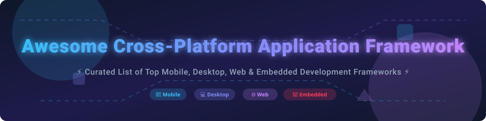

  

# 🚀 Awesome Cross-Platform Application Framework

  
  
  
  
  

---

## 📌 Overview & Ecosystem Highlights

Welcome to the ultimate **curated guide to cross-platform application development frameworks and tools** in 2026! Whether you are building mobile apps for **iOS and Android**, desktop software for **Windows, macOS, and Linux**, or embedded/web solutions, this repository helps software architects, engineers, and CTOs choose the optimal technology stack.

* **📱 Mobile Leaders**: **Flutter** and **React Native** dominate cross-platform UI development with native performance, hot reload capabilities, and extensive widget ecosystems.
* **⚡ Desktop Titans**: **Electron** powers major desktop tools like VS Code and Slack, while **Tauri** offers a lightweight, high-security Rust-backed alternative with minimal memory overhead.
* **🌐 Enterprise & Logic Sharing**: **Kotlin Multiplatform (KMP)** enables code sharing across platforms while maintaining native UI performance, backed by Google and JetBrains. **Avalonia** and **.NET MAUI** bring XAML and C# versatility across operating systems.

---

## 📖 Table of Contents

- [☁️ Commercial Platforms](#️-commercial-platforms)
- [🔓 Open-Source GitHub Projects](#-open-source-github-projects)
- [🤝 How to Contribute](#-how-to-contribute)
- [💖 Support & Sponsorship](#-support--sponsorship)
- [📈 Star History](#-star-history)
- [⚠️ Disclaimer](#️-disclaimer)

---

## ☁️ Commercial Platforms

> **📊 Market Context**: The global cross-platform application framework market is valued at **~$18 Billion in 2026** and is projected to reach **~$45 Billion by 2032** at a **~16% CAGR**. The sector is **moderately fragmented**: mobile development is anchored by Flutter and React Native, desktop is dominated by Electron and Qt, and emerging environments (such as HarmonyOS NEXT) drive adoption of Kotlin Multiplatform and KuiKly. No single vendor commands a winner-take-all monopoly, allowing development teams to select frameworks tailored to performance, language preference, and targeted platforms.

The commercial tools and platforms below are sorted by company size/valuation (descending):

| Platform | Description | Pricing (Starting Tier) | Free Tier Limits | Company Size |
| :--- | :--- | :--- | :--- | :--- |
| **[Microsoft .NET MAUI](https://dotnet.microsoft.com/apps/maui)** | **Microsoft's multi-platform UI framework.** Build native iOS, Android, macOS, and Windows apps with C# and XAML. | **Free** ($0 for framework; enterprise support bundled with Visual Studio subscriptions starting at $45/month) | **Unlimited free tier** (Open-source MIT license with no usage caps) | **~$281 Billion Revenue (Microsoft FY2025)** |
| **[Microsoft Xamarin](https://dotnet.microsoft.com/apps/xamarin)** | **Legacy cross-platform mobile framework.** Superseded by .NET MAUI for building native C# apps across platforms. | **Free** ($0 for framework; IDE tools included in Visual Studio) | **Unlimited free tier** (Open-source MIT license) | **~$281 Billion Revenue (Microsoft FY2025)** |
| **[Qt Commercial](https://www.qt.io/)** | **Industrial C++ cross-platform framework.** High-performance UI engine for desktop, mobile, and embedded device creation. | **$302/month** ($3,624/year billed annually per developer for Professional tier) | **10-day free trial limit** (Evaluation only; production deployment requires commercial license) | **Publicly Traded / ~$500 Million Revenue (Qt Group)** |

---

## 🔓 Open-Source GitHub Projects

The following curated open-source cross-platform frameworks are sorted by GitHub Stars_Count (descending):

| Repo | Description | GitHub_Stars |
| :--- | :--- | :--- |
| **[Flutter](https://github.com/flutter/flutter)** | **Google's UI toolkit for multi-platform apps.** High-performance rendering with Impeller, Dart language, and single-codebase deployment across iOS, Android, Desktop, Web, and Embedded. |  |
| **[React Native](https://github.com/facebook/react-native)** | **Meta's cross-platform framework.** Build native mobile applications using React, TypeScript/JavaScript, and native UI components. |  |
| **[Electron](https://github.com/electron/electron)** | **Build cross-platform desktop apps with JavaScript, HTML, and CSS.** Combines Chromium and Node.js for powerful desktop applications like VS Code. |  |
| **[Tauri](https://github.com/tauri-apps/tauri)** | **Lightweight, fast, and secure desktop & mobile framework.** Uses Rust backend with system webviews to deliver tiny binaries and low RAM footprint. |  |
| **[Ionic Framework](https://github.com/ionic-team/ionic-framework)** | **Web-first cross-platform mobile UI toolkit.** Build iOS, Android, and Progressive Web Apps using React, Angular, Vue, or Web Components. |  |
| **[Avalonia](https://github.com/AvaloniaUI/Avalonia)** | **WPF-style cross-platform .NET UI framework.** XAML layout and C# support for Windows, macOS, Linux (Wayland/X11), iOS, Android, and WebAssembly. |  |
| **[Kivy](https://github.com/kivy/kivy)** | **Open-source Python library for multi-touch applications.** Cross-platform support for iOS, Android, macOS, Windows, and Linux. |  |
| **[Flet](https://github.com/flet-dev/flet)** | **Build real-time multi-platform applications in Python powered by Flutter.** No frontend knowledge required. |  |
| **[NativeScript](https://github.com/NativeScript/NativeScript)** | **Open-source framework for building truly native mobile apps with JavaScript, TypeScript, Angular, or Vue.** |  |
| **[BeeWare (Toga)](https://github.com/beeware/toga)** | **Python-native cross-platform GUI toolkit.** Write your application in Python and render using native UI widgets on iOS, Android, and desktop. |  |
| **[Quasar Framework](https://github.com/quasarframework/quasar)** | **Vue.js based cross-platform framework.** Build responsive websites, PWAs, mobile apps (Capacitor/Cordova), and Electron desktop apps from one codebase. |  |
| **[Wails](https://github.com/wailsapp/wails)** | **Build desktop applications using Go and Web Technologies.** Lightweight alternative to Electron using system webview and Go backend. |  |
| **[Kotlin Multiplatform](https://github.com/JetBrains/kotlin-multiplatform)** | **Share business logic across platforms while retaining fully native UIs.** Endorsed by JetBrains and Google for Android, iOS, Desktop, and Web. |  |
| **[Apache Cordova](https://github.com/apache/cordova)** | **Mobile application development framework.** Target mobile platforms using HTML5, CSS3, and JavaScript wrapped in native containers. |  |

---

## 🤝 How to Contribute

Contributions are warmly welcomed! Please follow these simple steps to contribute:

1. 🍴 **Fork** this repository.
2. 📝 **Add/Update** framework information in `README.md`.
3. 🔍 Ensure descriptions are accurate, concise, and linked to official repositories or sites.
4. 📬 Submit a **Pull Request** with a summary of changes.

Check out our curated list collection at [Awesome-Awesome-Awesome](https://github.com/ishandutta2007/Awesome-Awesome-Awesome)!

---

## 💖 Support & Sponsorship

If you find this repository helpful for your software architecture decisions or cross-platform projects, please consider supporting the project:

* ⭐ **Star** this repository on GitHub to increase visibility.
* 🔀 **Fork** and share it with fellow developers and engineering teams.
* ☕ **Buy Me a Coffee / Sponsor**: Support ongoing maintenance via the [GitHub Sponsor Dashboard](https://github.com/sponsors/ishandutta2007).

---

## 📈 Star History

---

## ⚠️ Disclaimer

- This list is **community-curated** for informational purposes and does not imply official endorsement.
- Verify security configurations, third-party licensing, and app store compliance policies for each framework before deploying to production.
- Pricing details and framework stargazers counts are accurate as of October 2026. Always reference vendor documentation for real-time tier changes.
